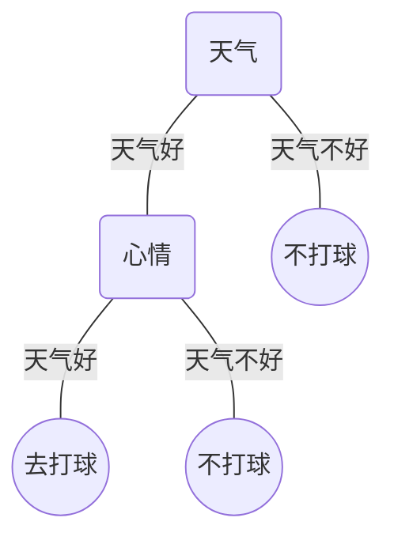

# Decision Tree

## what is the Decision Tree?

> 决策树算法是一种**树形结构**的**监督学习**算法，可用于**分类**与**回归**问题。下面将介绍一下树的各部分的含义。

* 根节点：最重要的特征
* 内部节点：特征
* 叶节点：决策树的结果

> 下图是以是构建”我是否去打球“的决策树，以天气与心情为特征，只是用于举例子假设对上面概念的理解，可能有些不太严谨。

> 那么问题来了，既然根节点跟内部节点都是表示的特征，而且节点的深度跟特征的重要性有关，所以我们得通过某种策略来选择特征来构建决策树。

## Attribute selection measures

