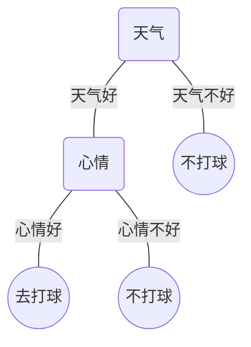
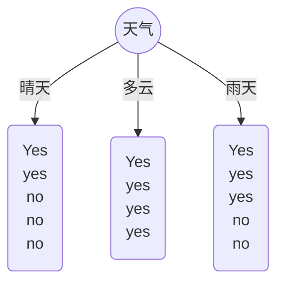

# Decision Tree

## what is the Decision Tree?

> 决策树算法是一种**树形结构**的**监督学习**算法，可用于**分类**与**回归**问题。下面将介绍一下树的各部分的含义。

* 根节点：最重要的特征
* 内部节点：特征
* 叶节点：决策树的结果

> 下图是以是构建”我是否去打球“的决策树，以天气与心情为特征，只是用于举例子假设对上面概念的理解，可能有些不太严谨。

> 那么问题来了，既然根节点跟内部节点都是表示的特征，而且节点的深度跟特征的重要性有关，所以我们得通过某种策略来选择特征来构建决策树。

## Attribute selection measures

> 特征选择是构建决策树比较重要的步骤，那我们该如何去选择特征呢？常用的有如下的几种方法

### 1. ID3 algorithm(based on Information gain)

> 在讲信息增益之前首先了解一下`Entropy`.

`Entropy`：熵是对不确定性(混乱程度，不确定性)的测量，熵越大代表随机变量的不确定性就越大，比如一组各种颜色的小球如果熵值越高则越不纯，结果也越不确定，反之。

$$ Entropy = \sum\limits_{i = 1}\limits^{n} -P_{i} * log_{2}(P_{i})$$

* `n` ：某个集合中样本种类数
* $P_{i}$ : 集合中第`i`类样本的概率

> `Information gain`: 根据给定的特征，计算数据集拆分前的熵和拆分后的熵之间的差异。不同的特征往往具有不同的信息增益，信息增益大的特征具有更强的分类能力。下面是一个信息增益计算的例子

* 基于天气划分我是否去打球

> 计算过程：

* 晴天时：$H_{1} = -\frac{2}{5}  log_{2}^{\frac{2}{5}} + -\frac{3}{5}  log_{2}^{\frac{3}{5}}  = 0.971$
* 多云时：$H_{2}$ = $-1 * log_{2}^{1} = 0$
* 雨天时：$H_3 =  -\frac{3}{5}  log_{2}^{\frac{3}{5}} + -\frac{2}{5}  log_{2}^{\frac{2}{5}}  = 0.971$
* 未根据特征拆分时的熵: $H = -\frac{9}{14}log_{2}^\frac{9}{14} + -\frac{5}{14}log_{2}^{\frac{5}{14}} = 0.940$
* 计算信息增益： $H_{\Delta} = H - \frac{5}{14}H1 - \frac{4}{14}H2 - \frac{5}{14}H3 = 0.247$

> 这只是天气这个特征对结果的影响，其他特征计算的方法类似，计算所有特征的信息增益然后以信息增益最大的特征拆分数据集。

### 2. Gini index

### 3. Method evaluation

